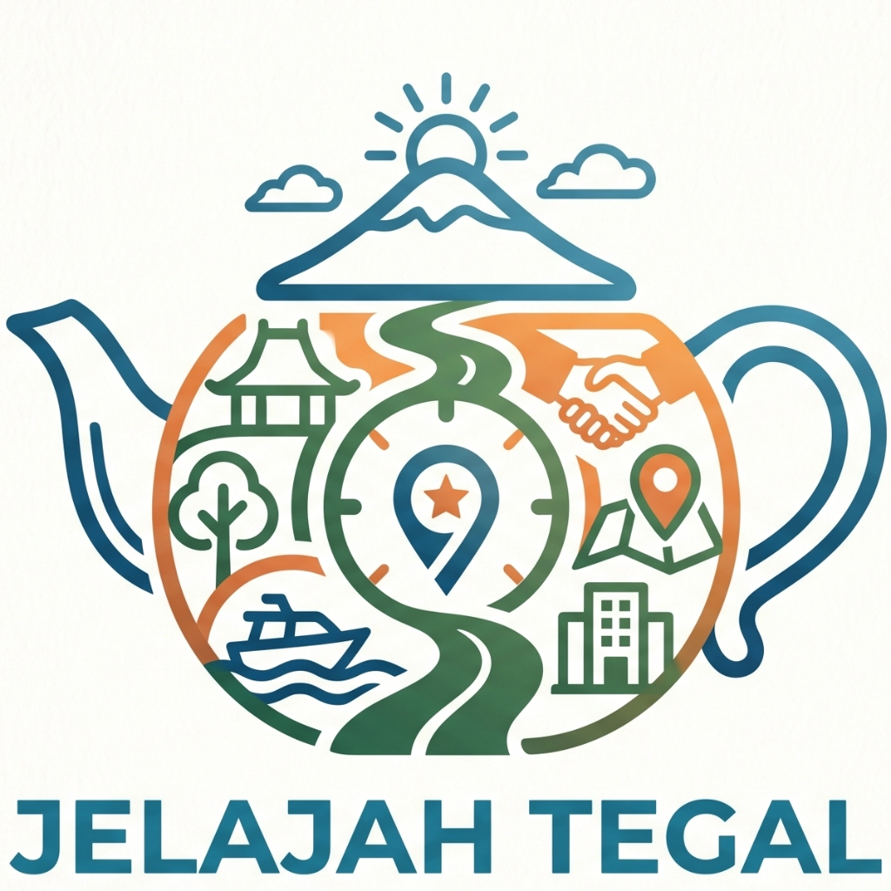

# 🌊 Jelajah Tegal — Platform Pariwisata & Ekonomi Kreatif Terpadu Tegal

<p align="center">
  
  <br>
  <strong>Ekosistem Digital Pariwisata, Perhotelan, Kuliner, Event, dan Rental Kabupaten & Kota Tegal</strong>
</p>

<p align="center">
  
  
  
  
  
</p>

---

## 📖 1. Tentang Sistem

**Jelajah Tegal** adalah platform web monolith modern berbasis *Multi-Tenant* yang menghubungkan wisatawan (konsumen publik) secara langsung dengan para pelaku usaha pariwisata, penginapan, kuliner khas, pengelola acara, serta armada transportasi di wilayah **Kabupaten Tegal dan Kota Tegal** (mencakup 21 Kecamatan).

Sistem ini mengadopsi arsitektur keamanan tingkat tinggi dengan verifikasi dokumen legal (KYC), moderasi ketat dari tim Admin, sistem kontrol akses berbasis peran (RBAC dengan tim Spatie), pemetaan geospasial interaktif Leaflet.js, serta penerbitan tiket ber-QR Code presisi.

---

## 🌟 2. Fitur Domain Bisnis Utama

Platform ini mengintegrasikan 5 domain pariwisata dan ekonomi lokal:

```
                                  ┌── 🏖️ Tourism (Destinasi Wisata)
                                  ├── 🏨 Accommodation (Hotel & Penginapan)
       🏢 JELAJAH TEGAL ──────────┼── 🍲 Culinary (Kuliner & Rumah Makan)
                                  ├── 🎪 Event (Acara, Festival & Seni)
                                  └── 🚗 Rental (Sewa Armada Transportasi)
```

### 🏖️ A. Wisata (Tourism)
* **Katalog Destinasi**: Foto sampul, galeri, kategori (Pantai, Pemandian Air Panas Guci, Curug, Agrowisata), fasilitas, dan koordinat GPS.
* **Paket Tiket & Kuota**: Pengaturan jenis tiket (*Reguler, Terusan, Weekend*), batas kuota harian, dan penerbitan tiket QR Code.
* **Jam Operasional**: Penjadwalan jam buka & tutup mingguan (Senin–Minggu).
* **Validasi Gerbang**: Scan tiket QR Code oleh petugas *Gatekeeper* pintu masuk secara real-time.

### 🏨 B. Penginapan (Accommodation)
* **Katalog Properti**: Hotel Bintang, Villa Asri, Resort Pantai, Homestay, hingga Glamping.
* **Manajemen Kamar (*Multi-Room Types*)**: Tipe kamar (*Standar, Deluxe, Suite*), kapasitas tamu dewasa/anak, tipe ranjang, luas ruangan, dan jumlah unit kamar.
* **Harga & Ketersediaan**: Tarif sewa kamar per malam, kalender ketersediaan unit, kebijakan check-in & check-out.

### 🍲 C. Kuliner (Culinary)
* **Buku Menu Restoran**: Kategori menu (*Makanan Utama, Minuman Segar, Paket Hemat*) lengkap dengan harga, deskripsi, dan foto menu.
* **Reservasi Meja & Slot Waktu**: Pemesanan meja makan (*Lunch/Dinner*) dengan kapasitas orang dan konfirmasi dari pihak restoran.

### 🎪 D. Event & Festival
* **Jadwal & Rundown**: Tanggal pelaksanaan, lokasi panggung, rundown acara seni & budaya Tegal.
* **Tiket Event**: Kategori tiket (*Early Bird, Presale, VIP, Reguler*) dengan pembatasan kuota penonton.

### 🚗 E. Rental Kendaraan
* **Armada Transportasi**: Sewa mobil (Avanza, Innova, HiAce), motor matic, dan sepeda wisata.
* **Tarif Fleksibel**: Tarif sewa harian (Lepas Kunci / Dengan Sopir).
* **Verifikasi Penyewa**: Verifikasi kartu identitas (KTP/SIM) dan transisi status booking (Disetujui, Diambil, Selesai).

---

## 👥 3. Struktur Role & Hak Akses (Multi-Surface)

Sistem membagi akses pengguna ke dalam 5 antarmuka khusus:

| Role / Surface | Dashboard URL | Fungsi & Tanggung Jawab |
| :--- | :--- | :--- |
| 👤 **Consumer** | `/` & `/consumer/dashboard` | Wisatawan umum: Mencari destinasi, memesan tiket wisata & hotel, reservasi meja, menulis ulasan bintang. |
| 🏢 **Mitra (Tenant)** | `/mitra/dashboard` | Pemilik usaha: Mengelola profil, mengunggah foto dengan live preview, mengatur harga, mengelola pesanan, verifikasi KYC, dan penarikan saldo (*Withdrawal*). |
| 🚪 **Gatekeeper** | `/gatekeeper/dashboard` | Petugas loket: Memindai (*scan*) dan memvalidasi tiket masuk ber-QR Code pengunjung. |
| 🛡️ **Admin Platform** | `/admin/dashboard` | Tim verifikator: Moderasi konten katalog sebelum tayang publik, review dokumen legal KYC mitra, permohonan fitur, dan voucher. |
| 👑 **Super Admin** | `/super-admin/dashboard` | Administrator sistem: Matriks hak akses (*Permissions*), sakelar fitur platform (*Feature Flags*), pengaturan sistem, dan log audit keamanan. |

---

## 💻 4. Persyaratan Sistem (Prerequisites)

Sebelum memulai instalasi, pastikan komputer/server Anda telah terpasang:

* **PHP** $\ge$ `8.2` (dengan ekstensi: `pdo_mysql`, `fileinfo`, `gd`, `mbstring`, `openssl`, `sodium`, `curl`)
* **Composer** $\ge$ `2.2`
* **MySQL** $\ge$ `8.0` atau **MariaDB** $\ge$ `10.5` (Wajib mendukung fungsi Geospasial `ST_PointFromText` / `SPATIAL INDEX`)
* **Web Server**: Apache / Nginx / Built-in PHP Server (Laragon / XAMPP direkomendasikan untuk Windows)
* **Git**

---

## 🚀 5. Panduan Instalasi Lokal (Step-by-Step)

### Langkah 1: Masuk ke Folder Proyek
Buka terminal (PowerShell / Command Prompt / Git Bash) dan arahkan ke folder proyek Laravel:
```bash
cd "lokantara-laravel"
```

---

### Langkah 2: Install Dependensi PHP via Composer
Jalankan composer untuk memasang semua library yang dibutuhkan:
```bash
composer install
```

---

### Langkah 3: Konfigurasi File Environment (`.env`)
Salin file `.env.example` menjadi `.env`:
```bash
cp .env.example .env
```
*(Di Windows PowerShell jika belum ada file `.env`, buat salinan atau edit `.env` yang sudah ada)*.

Buka file `.env` dan sesuaikan koneksi database MySQL Anda:
```env
APP_NAME="Jelajah Tegal"
APP_ENV=local
APP_KEY=
APP_DEBUG=true
APP_URL=http://127.0.0.1:8000

DB_CONNECTION=mysql
DB_HOST=127.0.0.1
DB_PORT=3306
DB_DATABASE=lokantara_new
DB_USERNAME=root
DB_PASSWORD=

FILESYSTEM_DISK=public
```

> **Catatan**: Pastikan Anda telah membuat database kosong bernama `lokantara_new` di MySQL/phpMyAdmin sebelum menjalankan migrasi.

---

### Langkah 4: Generate Application Key
Generate encryption key aplikasi:
```bash
php artisan key:generate
```

---

### Langkah 5: Jalankan Migrasi & Seeder Database
Eksekusi migrasi tabel dan pasang data seeder (Wilayah 21 Kecamatan Tegal, Role, Permissions, Akun Demo, Katalog Wisata & Hotel Purwahamba, serta Sate Wendy Tegal):
```bash
php artisan migrate --seed
```

Atau jika ingin menjalankan seeder komprehensif secara mandiri:
```bash
php artisan db:seed --class=ComprehensiveTestingSeeder
```

---

### Langkah 6: Hubungkan Storage Symlink (Khusus Windows)
Agar foto sampul, logo, dan galeri yang diunggah dapat diakses oleh browser, buat *NTFS Junction Link* storage:

**Untuk Windows (PowerShell / CMD)**:
```powershell
if (Test-Path "public\storage") { Remove-Item -Recurse -Force "public\storage" }
cmd /c mklink /J "public\storage" "storage\app\public"
```

**Untuk Linux / macOS**:
```bash
php artisan storage:link
```

---

### Langkah 7: Bersihkan Cache Aplikasi
Pastikan konfigurasi dan view bersih:
```bash
php artisan optimize:clear
```

---

### Langkah 8: Jalankan Server Lokal
Nyalakan local development server Laravel:
```bash
php artisan serve
```

Aplikasi sekarang aktif dan dapat dibuka melalui browser di:  
👉 **[http://127.0.0.1:8000](http://127.0.0.1:8000)**

---

## 🔑 6. Akun Pengujian / Demo Login

Gunakan kredensial berikut untuk menguji masing-masing hak akses:

| Role | Email Login | Password Default | Akses Dashboard |
| :--- | :--- | :--- | :--- |
| 👑 **Super Admin** | `superadmin@lokantara.test` | `password` | `http://127.0.0.1:8000/super-admin/dashboard` |
| 🛡️ **Admin Platform** | `admin@lokantara.test` | `password` | `http://127.0.0.1:8000/admin/dashboard` |
| 🏢 **Mitra Owner** | `tegaljelajah16@gmail.com` / `mitra@lokantara.test` | `password` | `http://127.0.0.1:8000/mitra/dashboard` |
| 🚪 **Gatekeeper Loket** | `gatekeeper@lokantara.test` | `password` | `http://127.0.0.1:8000/gatekeeper/dashboard` |
| 👤 **Wisatawan / User** | `consumer@lokantara.test` | `password` | `http://127.0.0.1:8000` |

---

## 📂 7. Struktur Direktori Proyek

```text
lokantara-laravel/
├── app/
│   ├── Actions/                  # Domain Business Actions (Tourism, Accommodation, Culinary, etc.)
│   ├── Enums/                    # Status Enums (CatalogStatus, MitraStatus, etc.)
│   ├── Http/
│   │   ├── Controllers/
│   │   │   ├── Admin/            # Admin Panel & Moderation Controllers
│   │   │   ├── Mitra/            # Mitra Dashboard Controllers
│   │   │   ├── Public/           # Public Portal & Directory Controllers
│   │   │   └── SuperAdmin/       # Super Admin System Controllers
│   │   └── Middleware/           # Tenant Context & Permission Security Middlewares
│   ├── Models/                   # Eloquent Models & Relationships
│   └── Services/                 # Core Services (MitraMediaStorage, AuditLogger, etc.)
├── config/
│   ├── navigation.php            # Sidebar Navigation per-Role
│   └── filesystems.php           # Storage & Disk Settings
├── database/
│   ├── migrations/               # Database Schemas (with Spatial MySQL Point support)
│   └── seeders/                  # Seeder 21 Wilayah Tegal, Roles, & Data Demo
├── public/
│   ├── images/logo.png           # Logo Resmi Jelajah Tegal
│   └── storage/                  # NTFS Junction Link ke storage/app/public
├── resources/
│   └── views/
│       ├── layouts/              # Public, Mitra, Admin, and Auth Layouts
│       ├── mitra/                # Dashboard Mitra Views (with Live Image Previews)
│       └── public/               # Public Views (Landing Page, Wisata, Hotel, Kuliner, Profil Mitra)
└── routes/
    ├── web.php                   # Public Routes & Routing Hub
    ├── mitra.php                 # Mitra Tenant Routes
    ├── admin.php                 # Admin Moderation Routes
    └── super-admin.php           # Super Admin Governance Routes
```

---

## 🛠️ 8. Tips & Troubleshooting

1. **Gambar Tidak Tampil (Error 404 pada URL `/storage/...`)**:
   * Di Windows, jalankan ulang perintah pembuatan *NTFS Junction*:
     ```powershell
     cmd /c mklink /J "public\storage" "storage\app\public"
     ```
2. **Error Database `ST_PointFromText` / Spatial Function**:
   * Pastikan menggunakan MySQL versi 8.0+ atau MariaDB 10.5+ yang mendukung fungsi geospasial WGS84 (SRID 4326).
3. **Menu Sidebar Tidak Berubah Setelah Update**:
   * Jalankan pembersihan cache bootstrap:
     ```bash
     php artisan optimize:clear
     ```

---

<p align="center">
  Dibuat dengan ❤️ untuk kemajuan Pariwisata & Ekonomi Kreatif <strong>Tegal Bahari</strong>.
</p>
