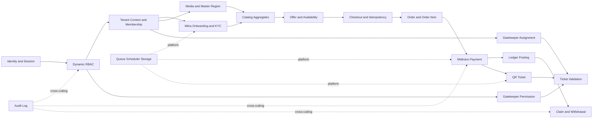

# Dependency Map

## Critical path

## Dependency inventory

| Capability | Upstream wajib | Downstream yang bergantung | Kegagalan utama |
| --- | --- | --- | --- |
| Identity/session | User, password/token policy | Semua authenticated surface | Tidak ada akses aman |
| RBAC | Identity, permission catalog | Admin/Mitra/gatekeeper policies | Privilege escalation |
| Tenant membership | Identity, RBAC, Mitra | Semua tenant-owned data | Cross-tenant leak |
| Mail/Queue | User contact, worker | Verification, reset, invitation, notification | Onboarding macet |
| Storage/Media | Ownership, disk config | KYC, profile, catalog, banner, virtual tour | Data leak/broken assets |
| Master region | Seed/import source | Address, Mitra, catalog search | Data lokasi tidak konsisten |
| KYC/bank | Tenant, private media, encryption | Active Mitra, claim | Compliance/payout terblokir |
| Catalog | Tenant, media, master, moderation | Offer, checkout, favorite/review | Tidak ada product valid |
| Availability/quota | Catalog, transaction locking | Checkout/ticket | Oversell |
| Order/item | Catalog offer, user, tenant | Payment, voucher, ticket, ledger | Transaksi tidak auditable |
| Midtrans | Order, secret, webhook security, idempotency | Ticket, ledger, notification | Double settlement/fraud |
| Ledger | Payment/order, chart/rules | Claim, finance dashboard | Saldo salah |
| Ticket | Paid order item, secure token | Validation | Fulfillment palsu |
| Gatekeeper | User, membership, permission, assignment | Validation | Unauthorized scan |
| Claim/withdrawal | Verified bank, ledger balance, dual control | Settlement | Kehilangan uang |
| Moderation | Permission, catalog/review state | Public visibility | Konten tidak layak tampil |
| Audit | Actor/request/tenant context | Support/security/compliance | Tidak ada traceability |
| Notification | Queue, preferences, domain events | Consumer/Mitra operations | Status penting tidak diketahui |

## Secondary dependencies

- Voucher bergantung pada stable checkout, cancellation, budget, dan reversal policy.
- Marketplace bergantung pada product variant, inventory reservation, shipping, refund/dispute, payment, ledger.
- Rental bergantung pada private document retention, availability locking, booking lifecycle.
- Virtual Tour bergantung pada media size/performance dan moderation.
- Analytics bergantung pada versioned domain events, metric definitions, timezone, aggregation.
- AI Planner bergantung pada catalog quality, Trip model, privacy/consent, LLM provider, cost and safety policy.

## Architectural dependency rules

1. Domain catalog tidak menulis payment/ledger langsung; semua melalui commerce services.
2. Frontend Livewire tidak memutuskan authorization atau state transition.
3. Queue job membawa actor/tenant context dan idempotency key bila menimbulkan side effect.
4. Notification merupakan consumer event; kegagalannya tidak membatalkan posted payment/ledger.
5. Feature flag tidak menggantikan permission atau tenant membership.

