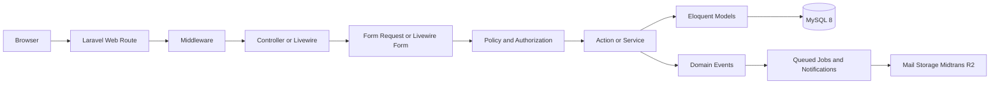

# Application Architecture

Status: TARGET_ARCHITECTURE. Dokumen ini mendeskripsikan target, bukan implementasi.

## Architectural style

Lokantara menjadi modular Laravel monolith: satu deployable application, satu authentication boundary, satu relational database, dan domain modules yang dipisahkan secara logis melalui namespace, actions, policies, events, serta ownership aturan data.

Web interaction tidak memakai REST internal. Blade merender halaman; Livewire menangani interaksi stateful; Alpine.js hanya untuk behavior browser lokal; Bootstrap 5 untuk presentation; Vite untuk asset pipeline. ApexCharts menerima data agregat dari query/service yang terdefinisi, bukan menghitung business metric di browser.

## Layers and responsibilities

| Layer | Tanggung jawab | Tidak boleh |
| --- | --- | --- |
| Routes | URL, name, middleware group, surface | Business rule dan query kompleks |
| Middleware | Auth/session, active Mitra resolution, MFA recency, feature availability, request context | Mengubah state domain |
| Controller/Livewire | Orchestrasi HTTP/UI, authorize, memanggil action, redirect/response | Menjadi god object atau menyimpan financial calculation |
| Form Request/Livewire Form | Input normalization, shape validation, conditional field validation | Authorization ownership akhir atau side effect |
| Policy/Gate | Permission, ownership, tenant, state-aware access | Mengandalkan nama role saja |
| Action | Satu use case command, transaction boundary, invariant dan event | Presentation/HTTP dependency |
| Service | Capability reusable/adapter orchestration/perhitungan domain kompleks | Menjadi collection helper generik tanpa boundary |
| Eloquent Model | Relasi, casts, scopes sederhana, domain state helpers kecil | Controller logic, provider call, hidden global tenant assumption |
| Event/Job | Async follow-up dan integration delivery | Menentukan source-of-truth transaction setelah commit tanpa idempotency |

## Module boundaries

Namespace folder standar tetap dipakai; domain dikenali lewat subnamespace seperti Actions/Orders, Services/Payments, Policies/TourismDestinationPolicy. Tidak dibuat package internal atau microservice sebelum ada kebutuhan deployment independen.

| Boundary | Isi utama |
| --- | --- |
| Identity | User, session, password, verification, OAuth, MFA, suspension |
| Authorization | Spatie roles/permissions, policy, tenant scope |
| Mitra | Tenant, membership, invitation, KYC, bank, features |
| Catalog | Tourism, Accommodation, Culinary, Event; V2 Rental/Marketplace/Virtual Tour |
| Commerce | Offer, checkout, order/item, voucher, availability reservation |
| Payment | Midtrans adapter, webhook inbox, reconciliation |
| Fulfillment | Ticket, QR, gatekeeper assignment/validation |
| Finance | Ledger, commission, claim/withdrawal |
| Platform | Media, moderation, notification, broadcast, CMS banner, region, settings, audit |

## Sync and async boundary

State yang menentukan respons user—authorization, availability reservation, order creation, payment state application, ticket single-use, ledger posting—diselesaikan sinkron dalam database transaction. Email, notification delivery, image processing, broadcast fan-out, cleanup, and non-critical analytics dijalankan setelah commit melalui queue.

## API exceptions

routes/api.php hanya untuk Midtrans webhook, direct-upload lifecycle, future mobile authenticated endpoints, AI provider/client integration, dan SSE/realtime bila web route tidak cocok. API harus memakai action/policy yang sama dengan web; tidak membuat business implementation kedua.

## Cross-cutting standards

- ULID business identifiers, UTC timestamps, MySQL DECIMAL for money.
- Request/correlation ID pada web, API, queue, dan provider events.
- Audit log append-only untuk sensitive commands.
- Explicit database transaction dan after-commit event dispatch.
- Fail closed untuk tenant, permission, MFA, signature, feature flag, dan unknown state.
- No production mock data.

