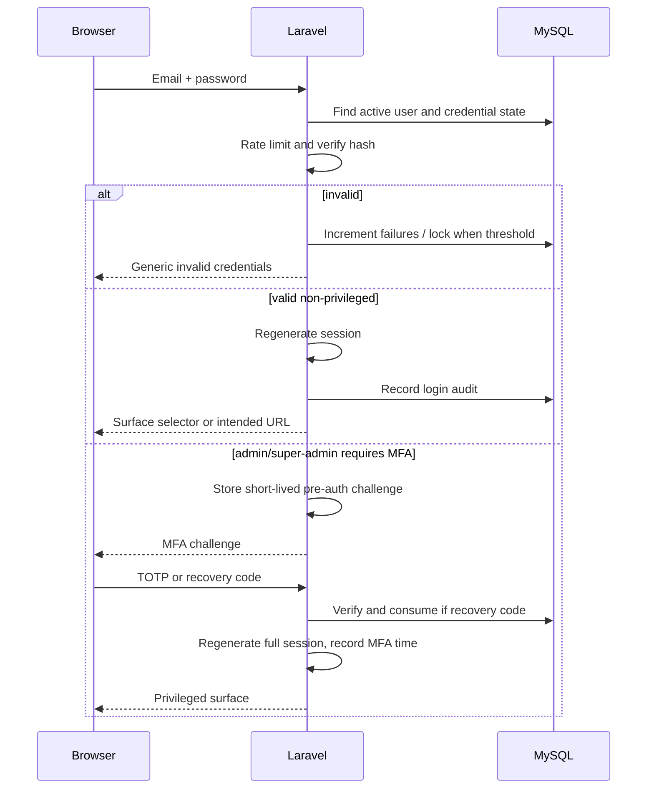

# Authentication Architecture

## Browser session

Web Blade/Livewire menggunakan Laravel stateful session dengan cookie HttpOnly, Secure di production, SameSite=Lax, session ID rotation setelah login/MFA/privilege change, CSRF protection, idle timeout dan absolute timeout untuk privileged surfaces. Legacy access/refresh token tidak dipertahankan atau dimigrasikan.

Session store V1 dapat database atau Redis sesuai deployment. Database session cukup untuk awal dan mendukung revoke; Redis dipilih bila traffic/HA menuntut. Session payload tidak menyimpan permission snapshot permanen atau secret.

## Login flow

Error login tidak membedakan email tidak ditemukan, password salah, suspended, atau unverified secara detail sebelum credential proof, untuk mengurangi enumeration. Suspension tetap memblokir session baru dan dapat merevoke session aktif.

## Multi-role login

Satu identity dan satu session digunakan lintas surface. Setelah login, resolver menentukan accessible surfaces dari effective permissions dan memberships. Tidak ada endpoint login terpisah yang membuat identity admin/consumer berbeda. User diarahkan ke intended route bila authorized; jika memiliki beberapa surface, tampilkan surface/tenant chooser.

Role name bukan redirect authority. Contoh: user berrole mitra-staff tetapi tidak memiliki membership aktif tidak dapat masuk surface Mitra.

## Registration and verification

- Public registration hanya membuat consumer identity.
- Email disimpan normalized dan unique menurut keputusan database.
- Verification link signed, expiring, one-use semantically, dan rate-limited.
- Session belum verified hanya boleh mengakses verification/logout/profile-minimal routes.
- Owner/staff/gatekeeper dibuat atau dihubungkan melalui invitation, bukan public role selection.

## Password reset

Reset token ter-hash, expiring, one-use. Successful reset meregenerate credential, merevoke semua session lain, membatalkan outstanding reset tokens, dan menulis audit/security notification. Password tidak pernah dikirim melalui email atau log.

## Google OAuth

Gunakan authorization-code flow melalui server-side adapter, direkomendasikan Laravel Socialite saat implementasi. State dan PKCE digunakan bila adapter mendukung. Callback memverifikasi state, issuer/audience/nonce sesuai flow, verified email, lalu:

- membuat consumer baru bila email belum ada;
- meminta authenticated explicit linking untuk akun existing berisiko;
- tidak menaikkan privilege atau membuat membership berdasarkan Google claims;
- tetap meminta MFA untuk admin/super-admin.

Provider subject disimpan sebagai external identity; access/refresh token Google hanya disimpan bila benar-benar dibutuhkan, encrypted, dan tidak untuk login-only.

## MFA and recovery

TOTP secret dienkripsi at rest dengan versioned application encryption key. Recovery codes ditampilkan sekali dan disimpan ter-hash. MFA wajib untuk admin dan super-admin; step-up/recent MFA direkomendasikan untuk RBAC, sensitive settings, KYC decision, bank change, claim approval, dan finance export.

MFA reset hanya melalui recovery code atau audited super-admin process dengan dual confirmation. Super-admin tidak dapat menonaktifkan MFA terakhirnya sendiri tanpa secondary control.

## Account lock and suspension

Lock bersifat security-temporary akibat failed attempts; suspension adalah administrative domain state. Lock dapat berakhir otomatis atau direset secara audited. Suspension memblokir action dan dapat memicu session revocation. Generic errors mencegah user enumeration.

## Future API/mobile

Jika mobile ditambahkan, gunakan Laravel Sanctum personal access tokens/abilities atau OAuth server setelah threat assessment. Token API terpisah dari browser session dan tidak menghidupkan kembali schema refresh-token legacy secara otomatis.

