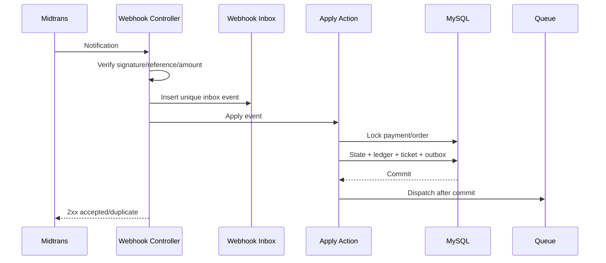

# Payment and Webhook Design

## Boundary

Payment is provider-neutral internally; Midtrans is the V1 adapter. Order owns commercial intent, Payment owns provider attempt/state, Ledger owns accounting, Ticket owns fulfillment. Provider payload is evidence, not business state by itself.

## Checkout and initiation

1. Consumer submits checkout with idempotency key.
2. Action authorizes buyer, validates active offer/tenant, locks/reserves quota, calculates decimal totals, and creates order/items.
3. Commit pending order with payment deadline.
4. Create/reuse Midtrans transaction using unique order/payment reference.
5. Save safe provider reference/redirect or Snap token encrypted/limited as required.
6. Return Blade/Livewire result; no client-supplied amount is trusted.

Same idempotency key and fingerprint returns prior result. Same key with different payload is 409-equivalent conflict.

## Webhook ingress

routes/api.php exposes a single versioned Midtrans notification endpoint. CSRF exemption is exact-route only. Controller reads required raw/request values, verifies signature using server key, validates order/provider reference and amount/currency, then persists an inbox event with unique provider event identity or deterministic fingerprint.

Return 2xx for already accepted duplicate. Invalid signature/amount/reference is rejected and security-logged without secret/payload leakage.

## Application transaction

ApplyMidtransNotification runs idempotently under database transaction and row locks:

- loads payment/order and inbox event;
- maps allow-listed provider status to internal enum;
- rejects invalid backwards/unknown transition;
- marks payment/order state once;
- posts balanced journal once;
- issues tickets once for eligible items;
- records audit/outbox;
- marks inbox processed.

Notifications are queued after commit. A delivery failure cannot roll back paid status.

## Sequence

## Financial precision

- MySQL DECIMAL(15,2) for monetary values; CHAR(3) currency.
- PHP decimal string/value object with BCMath or approved decimal library.
- Never float, implicit locale parsing, or price in JSON.
- Order/item/commission/tax/discount values are snapshots.
- Provider amount is compared using canonical decimal representation.
- Rounding policy is explicit and tested per line/header.

## Ledger

Posted journal is immutable and balanced per currency. A unique business event key prevents duplicate posting. Correction uses reversal, never update/delete. Mutable Mitra balance is a projection/cache only and reconstructable.

## Expiry and reconciliation

Scheduler expires unpaid orders and releases reservation atomically. Separate reconciliation queries pending/ambiguous provider states and reports mismatch. It never silently turns unknown transaction into paid without verified provider evidence.

## Refund/dispute

Not implemented in V1 architecture beyond extension points. No generic status toggle is permitted. Future design must cover partial amount, provider API, order/item, availability, ticket revocation, voucher reversal, commission, ledger reversal, dispute evidence, and notification.

## Security and observability

Secrets reside in environment/secret manager, not settings UI plaintext. Logs contain correlation ID, provider/event reference, internal IDs, result and duration—never server key, card data, full token, or unrestricted payload. Alerts cover signature failures, repeated processing failures, paid-without-ledger, amount mismatch, and queue lag.

