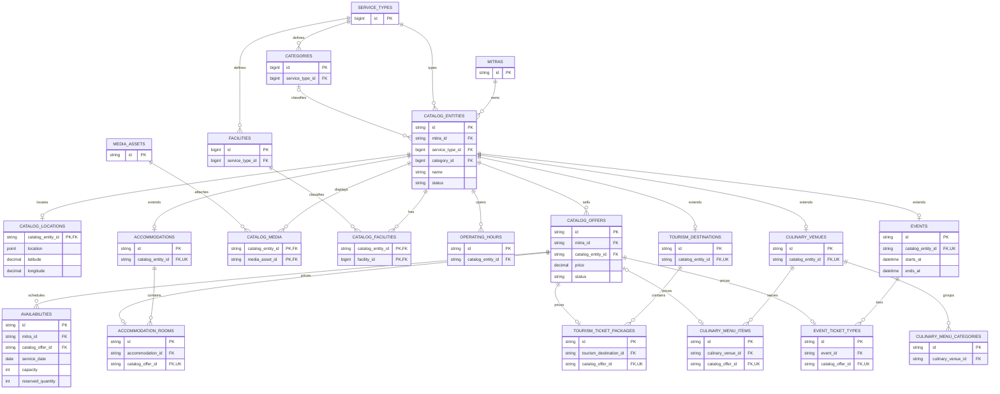
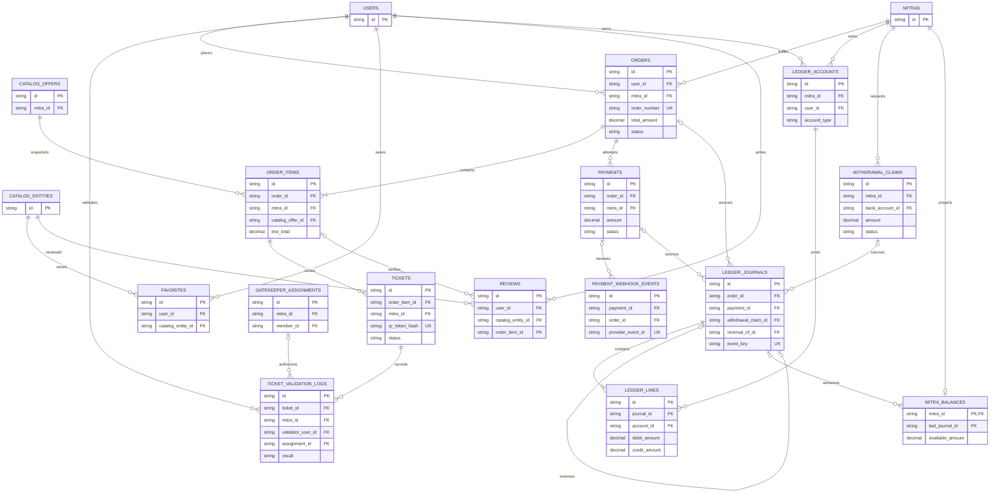
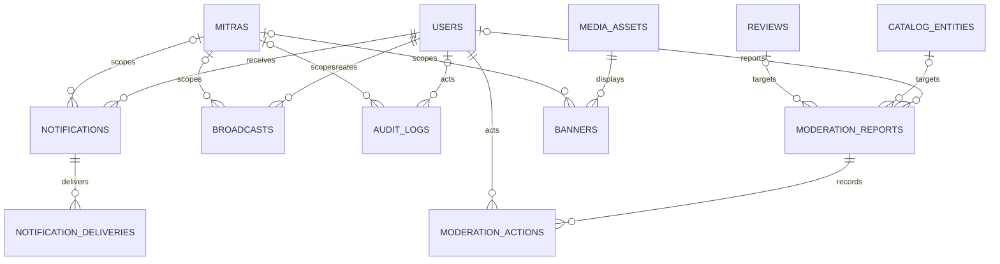
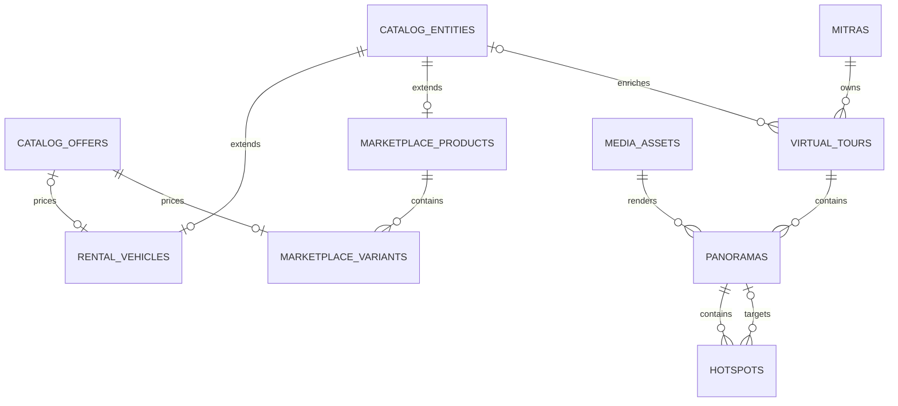

# MySQL ERD

ERD dipisah per bounded context. ULID ditulis string; reference BIGINT ditulis bigint. Detail type/default/index/delete rule otoritatif ada pada data dictionary dan relationship design.

## Identity, RBAC, and Mitra

```mermaid
erDiagram
    USERS {
        string id PK
        string email UK
        string status
        datetime deleted_at
    }
    USER_PROFILES {
        string id PK
        string user_id FK,UK
        string avatar_media_id FK
    }
    USER_CREDENTIALS {
        string id PK
        string user_id FK,UK
        string password_hash
        text mfa_secret_encrypted
    }
    SESSIONS {
        string id PK
        string user_id FK
        int last_activity
    }
    OAUTH_IDENTITIES {
        string id PK
        string user_id FK
        string provider
        string provider_subject UK
    }
    MITRAS {
        string id PK
        string owner_user_id FK
        bigint region_id FK
        string slug UK
        string status
    }
    MITRA_MEMBERS {
        string id PK
        string mitra_id FK
        string user_id FK
        string status
    }
    MITRA_FEATURES {
        string id PK
        string mitra_id FK
        bigint service_type_id FK
        string status
    }
    MITRA_BANK_ACCOUNTS {
        string id PK
        string mitra_id FK
        string account_fingerprint UK
        string status
    }
    MITRA_KYC_DOCUMENTS {
        string id PK
        string mitra_id FK
        string media_asset_id FK
        string status
    }
    ROLES {
        bigint id PK
        string mitra_id FK
        string name
    }
    PERMISSIONS {
        bigint id PK
        string name UK
    }
    MODEL_HAS_ROLES {
        bigint role_id FK
        string model_id FK
        string mitra_id FK
    }
    MODEL_HAS_PERMISSIONS {
        bigint permission_id FK
        string model_id FK
        string mitra_id FK
    }
    ROLE_HAS_PERMISSIONS {
        bigint role_id PK,FK
        bigint permission_id PK,FK
    }
    SERVICE_TYPES {
        bigint id PK
        string code UK
    }
    REGIONS {
        bigint id PK
        bigint parent_id FK
        string code UK
    }
    MEDIA_ASSETS {
        string id PK
        string mitra_id FK
        string owner_user_id FK
        string object_key UK
    }

    USERS ||--o| USER_PROFILES : has
    USERS ||--|| USER_CREDENTIALS : authenticates
    USERS ||--o{ SESSIONS : opens
    USERS ||--o{ OAUTH_IDENTITIES : links
    USERS ||--o{ MITRAS : owns
    USERS ||--o{ MITRA_MEMBERS : joins
    MITRAS ||--o{ MITRA_MEMBERS : contains
    MITRAS ||--o{ MITRA_FEATURES : enables
    SERVICE_TYPES ||--o{ MITRA_FEATURES : identifies
    MITRAS ||--o{ MITRA_BANK_ACCOUNTS : pays_to
    MITRAS ||--o{ MITRA_KYC_DOCUMENTS : submits
    MITRAS ||--o{ ROLES : scopes
    ROLES ||--o{ MODEL_HAS_ROLES : assigned
    USERS ||--o{ MODEL_HAS_ROLES : receives
    PERMISSIONS ||--o{ MODEL_HAS_PERMISSIONS : grants
    USERS ||--o{ MODEL_HAS_PERMISSIONS : receives
    ROLES ||--o{ ROLE_HAS_PERMISSIONS : contains
    PERMISSIONS ||--o{ ROLE_HAS_PERMISSIONS : belongs
    MITRAS ||--o{ MEDIA_ASSETS : owns
    USERS ||--o{ MEDIA_ASSETS : owns
    MEDIA_ASSETS ||--o{ MITRA_KYC_DOCUMENTS : stores
    REGIONS ||--o{ REGIONS : contains
    REGIONS o|--o{ MITRAS : locates
```

## Shared catalog and V1 domains

## Commerce, ticket, and finance

## Platform

## V2 domain extension

V2 entities are design-only. Social, AI, analytics, refunds, disputes, invoice, booking reference, shipment, and generic CMS do not appear because they are excluded or awaiting redesign.

